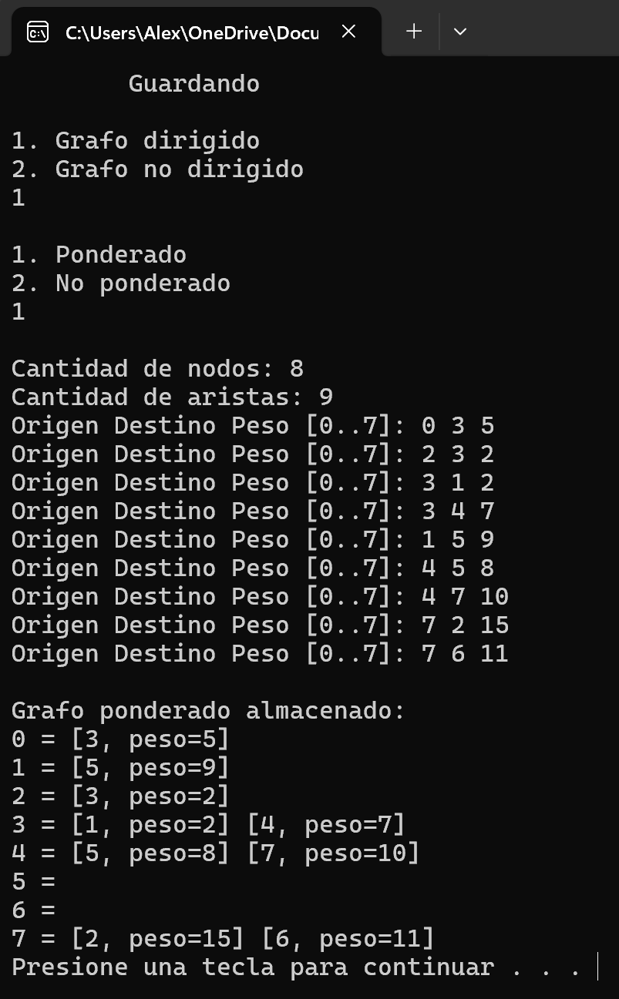
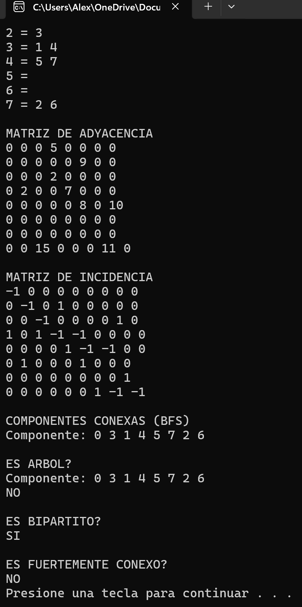
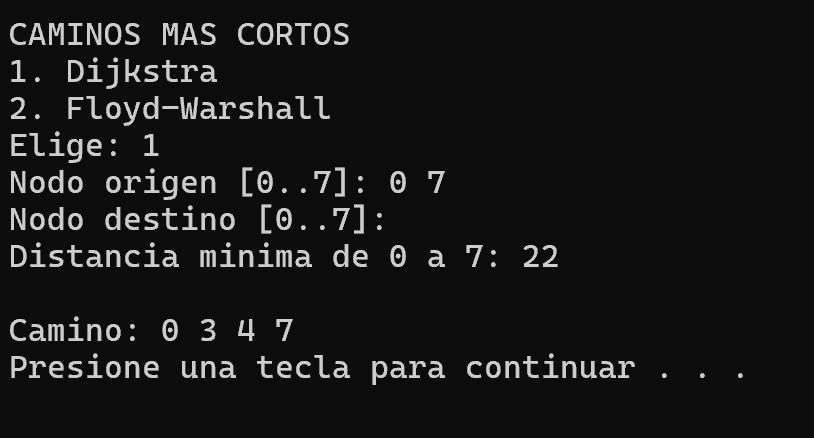
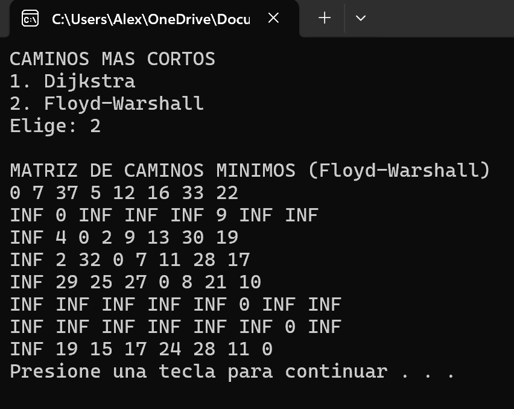
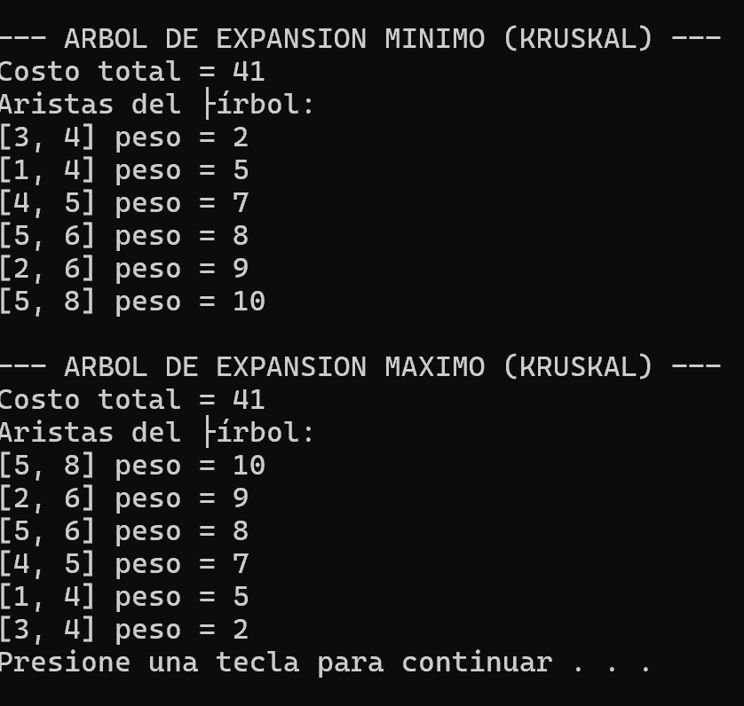
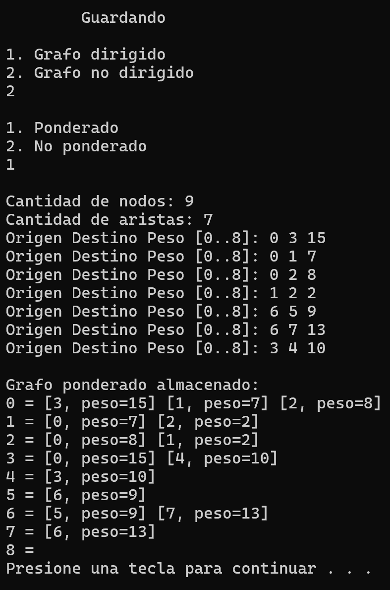
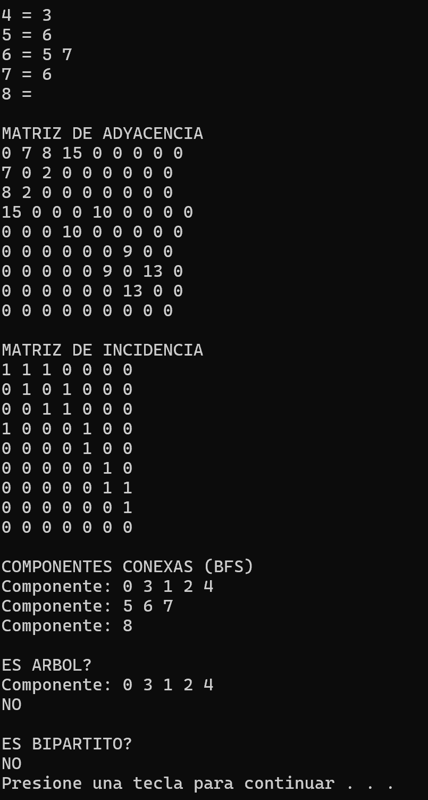
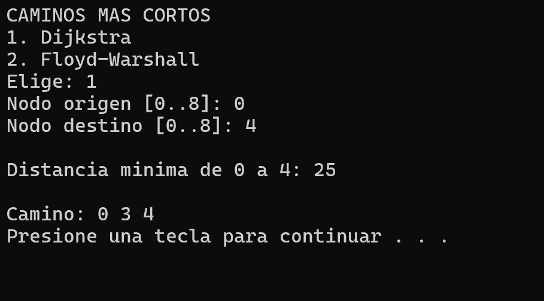
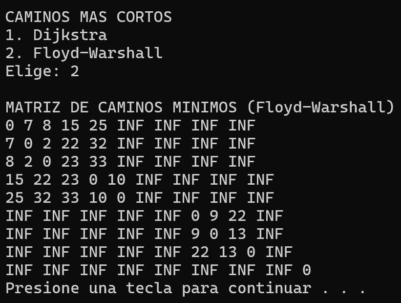
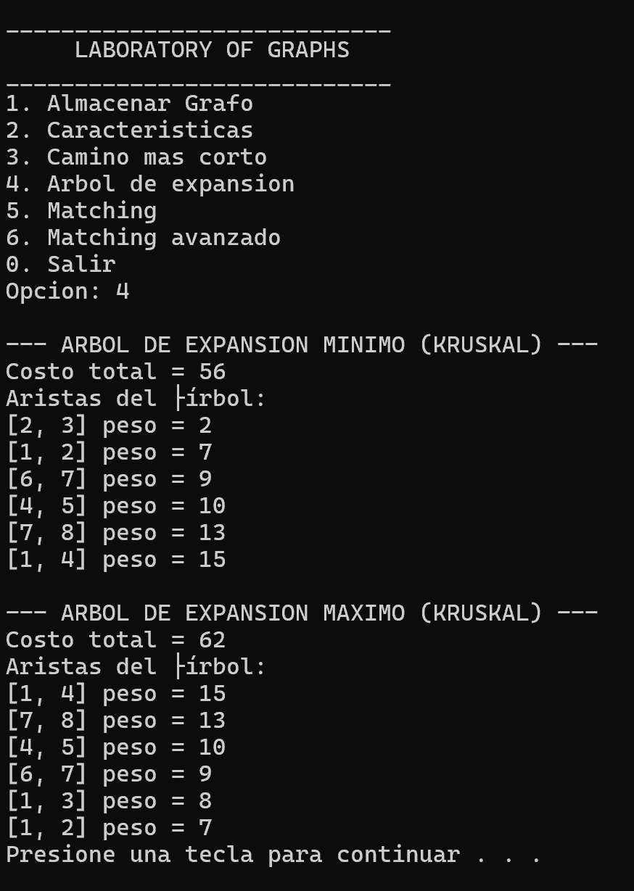

# Testeos realizados para el proyecto

##  Grafo 1 — Dirigido y Ponderado

**Nodos:** 8  
**Aristas:** 9  

**Conexiones (Origen, Destino, Peso):**

**{ [0 3 5], [2 3 2], [3 1 2], [3 4 7], [1 5 9], [4 5 8], [4 7 10], [7 2 15], [7 6 11] }**

El programa almacena inicialmente el grafo en una **lista de adyacencia**, la cual posteriormente se transforma en:

- **Matriz de adyacencia**
- **Matriz de incidencia**

Estos resultados se muestran en el **apartado 2 del menú (Características)**, donde también se despliega información relevante como:

-  No es un árbol  
-  No es fuertemente conexo  
-  Es bipartito  

  
  

---

##  Caminos más cortos

En el **apartado 3 del menú**, se muestran los caminos mínimos.

Para este grafo se aplicó el algoritmo **Dijkstra**, obteniendo el camino más corto entre los nodos:

- **0 -> 7**  
- **Peso total:** **22**

También se utiliza **Floyd–Warshall**, el cual genera la matriz con el costo mínimo entre **todos los pares de nodos**.

  
  

---

##  Árboles de expansión

En el **apartado 4 del menú**, el programa genera:

-  **Árbol de expansión mínimo (MST)**  
-  **Árbol de expansión máximo**

Ambos muestran su **peso total** correspondiente.

  

---

## Matching (Emparejamiento)

La verificación del **matching máximo** puede variar, ya que no siempre existe una sola solución óptima.  
En el **apartado 5 y 6 del menú**, el programa permite evaluar los emparejamientos y obtener uno de los posibles resultados correctos.

Se recomienda ejecutar el algoritmo con el grafo cargado para observar las diferentes posibilidades de matching según la estructura del grafo.

---

##  Grafo 2 — No dirigido y Ponderado

**Nodos:** 9 
**Aristas:** 7 

**Conexiones (Origen, Destino, Peso):**

**{ [0 3 15], [0 1 7], [0 2 8], [1 2 2], [3 4 10], [6 5 9], [6 7 13] }**

El programa almacena inicialmente el grafo en una **lista de adyacencia**, la cual posteriormente se transforma en:

- **Matriz de adyacencia**
- **Matriz de incidencia**

Estos resultados se muestran en el **apartado 2 del menú (Características)**, donde también se despliega información relevante como:

-  No es un árbol  
-  No aplica si es fuertemente conexo ya que es un grafo no dirigido  
-  No es bipartito  

  
  

---

##  Caminos más cortos

En el **apartado 3 del menú**, se muestran los caminos mínimos.

Para este grafo se aplicó el algoritmo **Dijkstra**, obteniendo el camino más corto entre los nodos:

- **0 -> 4**  
- **Peso total:** **25**

También se utiliza **Floyd–Warshall**, el cual genera la matriz con el costo mínimo entre **todos los pares de nodos**.

  
  

---

##  Árboles de expansión

En el **apartado 4 del menú**, el programa genera:

-  **Árbol de expansión mínimo (MST)**  
-  **Árbol de expansión máximo**

Ambos muestran su **peso total** correspondiente.

  

---

---
**Nota:** En los grafos no ponderados solo se puede acceder a caracteristicas y matching, en los demas algoritmos no es posible ya que es obligatorio que esten ponderados para poder aplicar la logica con ellos.

De igual forma le invito que pruebe diversos grafos para la comprobación de dichos algortimos aplicados en este programa.  

